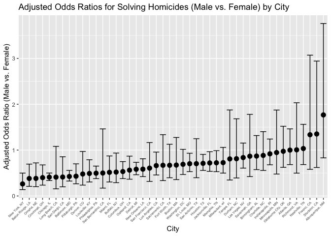

p8105_hw6_jw4489
================
2023-12-02

``` r
library(tidyverse)
library(purrr)
library(modelr)
library(dplyr)
library(broom)
```

## Problem 1

``` r
homicide = read.csv("hw6data/homicide-data.csv")
view(homicide)
```

##### Load and clean data

``` r
df1 = homicide |>
  janitor::clean_names() |> 
  mutate(city_state = paste(city, state, sep = ", ")) |>
  mutate(solved = ifelse(disposition == "Closed by arrest", 1, 0)) |>
  filter(!(city %in% c("Dallas", "Phoenix", "Kansas City", "Tulsa"))) |>
  filter(victim_race == "White" | victim_race == "Black") |>
  mutate(victim_age = as.numeric(victim_age))
```

    ## Warning: There was 1 warning in `mutate()`.
    ## ℹ In argument: `victim_age = as.numeric(victim_age)`.
    ## Caused by warning:
    ## ! NAs introduced by coercion

``` r
view(df1)  
```

##### Baltimore model

``` r
baltimore_df = na.omit(df1) |>
   filter(city_state == "Baltimore, MD")
```

``` r
baltimore_model = 
  glm(disposition == "Closed by arrest" ~ victim_age + victim_sex + victim_race, 
                      data = baltimore_df, family = binomial)
```

``` r
baltimore_results = baltimore_model |>
  broom::tidy() |>
  filter(term == "victim_sexMale") |>
  mutate(estimate_or = exp(estimate), 
         CI_lower = exp(estimate - 1.96 * std.error),
         CI_upper = exp(estimate + 1.96 * std.error)) |>
  knitr::kable()      

baltimore_results
```

| term           |   estimate | std.error | statistic | p.value | estimate_or | CI_lower |  CI_upper |
|:---------------|-----------:|----------:|----------:|--------:|------------:|---------:|----------:|
| victim_sexMale | -0.8544628 | 0.1381762 | -6.183864 |       0 |   0.4255117 | 0.324559 | 0.5578655 |

##### Each city

``` r
city_results = df1 |>
  nest(data = -city_state) |>
  mutate(models = map(data, \(df) glm(solved ~ victim_age + victim_sex + victim_race, data = df, family = binomial())),
         results = map(models, broom::tidy)) |> 
  select(-models) |> 
  unnest(results) |>
  filter(term == "victim_sexMale") |>
  mutate(estimate_or = exp(estimate),
         CI_lower = exp(estimate - 1.96 * std.error),
         CI_upper = exp(estimate + 1.96 * std.error)) |>
  select(city_state, term, estimate_or, CI_lower, CI_upper)

city_results
```

    ## # A tibble: 46 × 5
    ##    city_state      term           estimate_or CI_lower CI_upper
    ##    <chr>           <chr>                <dbl>    <dbl>    <dbl>
    ##  1 Albuquerque, NM victim_sexMale       1.77     0.831    3.76 
    ##  2 Atlanta, GA     victim_sexMale       1.00     0.684    1.46 
    ##  3 Baltimore, MD   victim_sexMale       0.426    0.325    0.558
    ##  4 Baton Rouge, LA victim_sexMale       0.381    0.209    0.695
    ##  5 Birmingham, AL  victim_sexMale       0.870    0.574    1.32 
    ##  6 Boston, MA      victim_sexMale       0.674    0.356    1.28 
    ##  7 Buffalo, NY     victim_sexMale       0.521    0.290    0.935
    ##  8 Charlotte, NC   victim_sexMale       0.884    0.557    1.40 
    ##  9 Chicago, IL     victim_sexMale       0.410    0.336    0.501
    ## 10 Cincinnati, OH  victim_sexMale       0.400    0.236    0.677
    ## # ℹ 36 more rows

##### Plots

``` r
results_plot = city_results |>
  mutate(city_state = fct_reorder(city_state, estimate_or)) |> 
  ggplot(aes(x = city_state,y = estimate_or)) + 
  geom_point(size = 3) + 
  geom_errorbar(aes(ymin = CI_lower,ymax = CI_upper)) + 
  labs(x = "City", y = "Adjusted Odds Ratio (Male vs. Female)",
       title = "Adjusted Odds Ratios for Solving Homicides (Male vs. Female) by City") +
  theme(axis.text.x = element_text(size = 5, angle = 45, hjust = 1))

results_plot
```

<!-- -->

## Problem 2

##### Load data

``` r
weather_df = 
  rnoaa::meteo_pull_monitors(
    c("USW00094728"),
    var = c("PRCP", "TMIN", "TMAX"), 
    date_min = "2022-01-01",
    date_max = "2022-12-31") |>
  mutate(
    name = recode(id, USW00094728 = "CentralPark_NY"),
    tmin = tmin / 10,
    tmax = tmax / 10) |>
  select(name, id, everything())
```

    ## using cached file: /Users/jiyingwang/Library/Caches/org.R-project.R/R/rnoaa/noaa_ghcnd/USW00094728.dly

    ## date created (size, mb): 2023-09-28 10:20:02.72248 (8.524)

    ## file min/max dates: 1869-01-01 / 2023-09-30
